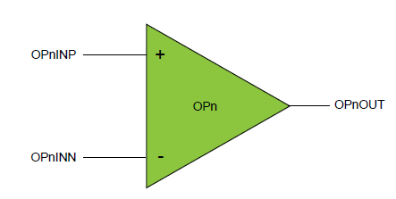

# Getting started with Mindi™ simulation and AVR®DB microcontrollers
This guide will get you up and running with simulating the analog OPAMP module in AVR DB family devices using the Mindi simulation tool. For a larger overview, see ["Getting Started with Analog Signal Conditioning (OPAMP)"](https://github.com/search?q=topic%3Aavr-db+topic%3Agetting-started-with-opamp+org%3Amicrochip-pic-avr-examples).

## Configuration: Connected Directly to Pins
This configuration connects the bare op amp directly to the pins, allowing any standard op amp configuration to be achieved by connecting the appropriate external components

### Mindi Simulation

Download and open the **Mindi schematic [here](https://github.com/microchip-pic-avr-examples/avrdb-opamp-mindi-direct-connection/releases/latest)**

Press the _play_ button to simulate with an example stimulus source. Note that the un-connected op amp example is provided without any standard external circuitry. 

### Tweaking
This configuration has no adjustable parameters.

### Don't have Mindi?
You can download and install the [Mindi simulation tool](https://www.microchip.com/mplab/mplab-mindi), or use another SPICE simulator of your own preference. For use with different simulators, a plain spice model can be found in "Opamp_AVR_DB.txt" to replace the mindi-optimized ".lb" 
